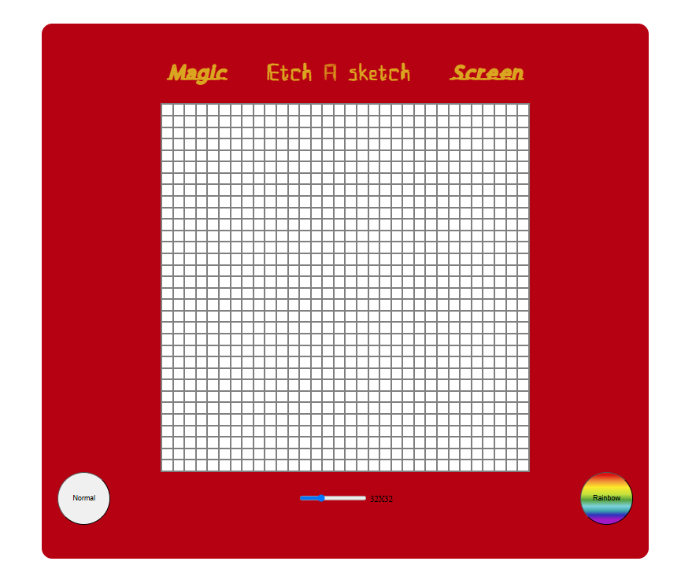

# Etch-a-Sketch - a project made for odin project

This project is a recreation between a sketch pad with a design of etch a sketch
It has a screen that is initially blank, to use it choose the grid number between 1 and 100 in a range button located after the bottom of container.

Hover the mouse on the screen to color the blocks. 

You can choose 2 modes of coloring the screen: 

Rainbow : chooses a random color in rgb format whenever you hover the screen

Normal : Only uses gray color.

----

## Challenges

Implementing only using flexbox for the first time was bit complicated.
I had to use a bit of math and flexbox for the grid. About the border for the block division I set box-sizing to border-block so the blocks don't overlap the container
when wrapping with flex.

Another challenge is the lag when rendering the grid. To solve that instead of input event listeners I used a click event so the grid is rendered after the mouse button is up.

---

## Design

